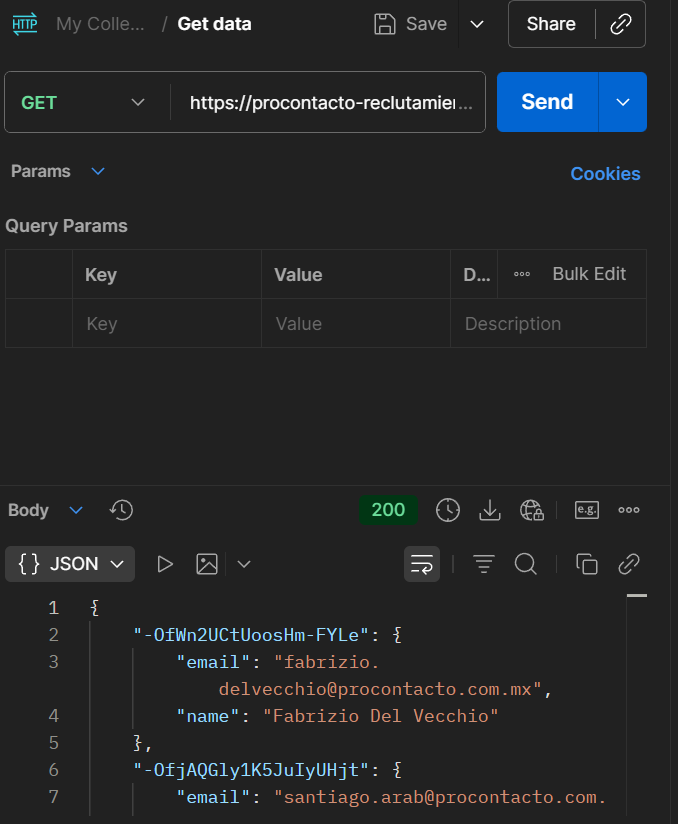
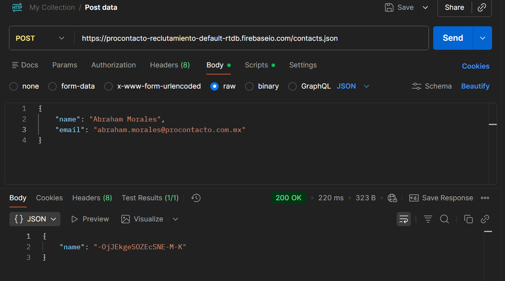
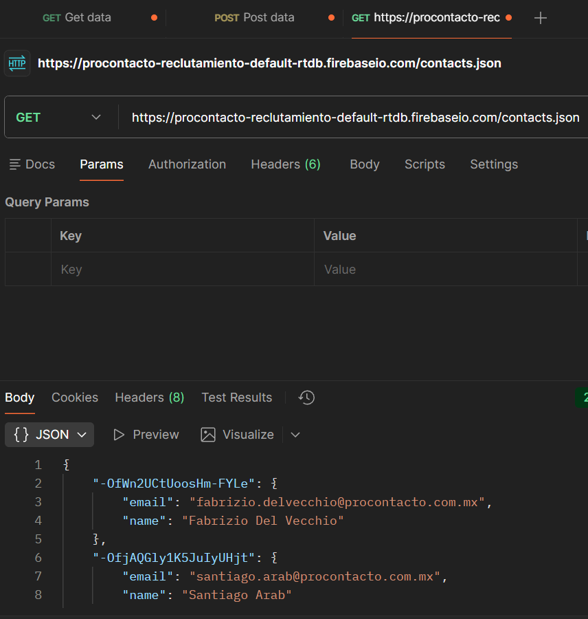
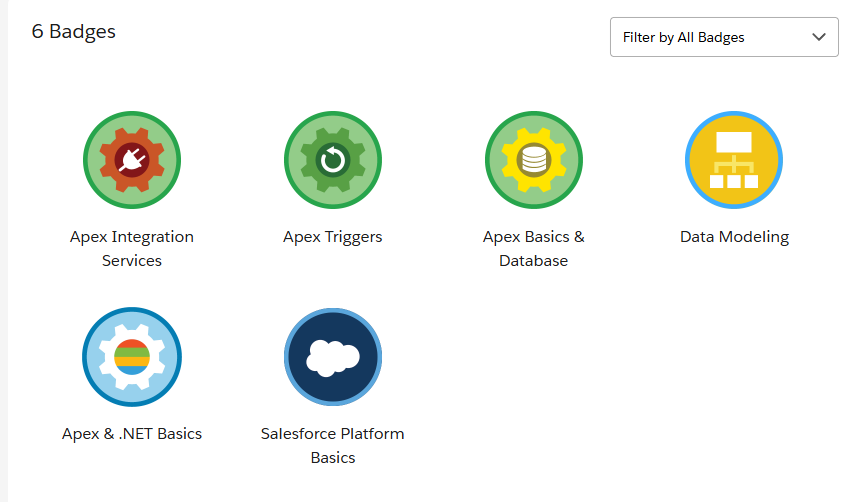
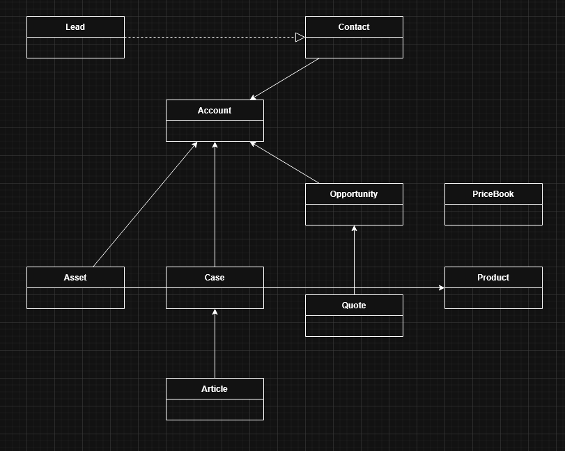
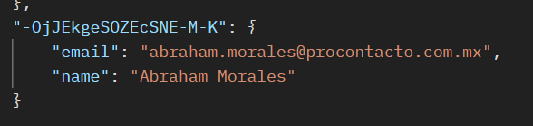
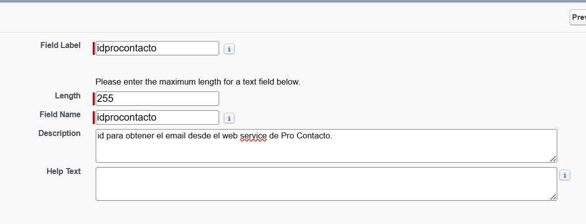

# Ejercicios Salesforce

## Ejercicio 2 - Conceptos HTTP

### 1. ¿Qué es un servidor HTTP?

Es un software que recibe peticiones HTTP de usuarios y una vez es aceptada la solicitud, buscará en los archivos del servidor los datos pertinentes y los devuelve.

### 2. ¿Qué son los verbos HTTP? Mencionar los más conocidos

- **GET**: obtiene información
- **POST**: enviar datos para crear un recurso
- **PUT**: actualiza un recurso
- **PATCH**: actualiza parcialmente un recurso
- **DELETE**: elimina
- **HEAD**: obtener los headers
- **OPTIONS**: consultar los métodos permitidos

### 3. ¿Qué es un request y un response en una comunicación HTTP? ¿Qué son los headers?

- **Request**: es un mensaje que el usuario envía al servidor solicitando un recurso
- **Response**: es el mensaje que el servidor devuelve al usuario con su resultado
- **Headers**: son datos que acompañan al request o response con información adicional como:
  - Autentificación
  - Codificación
  - Longitud del mensaje

### 4. ¿Qué es un queryString? (En el contexto de una URL)

Es la parte del URL que utiliza para enviar parámetros al servidor mediante pares clave-valor, y va siempre después del signo de interrogación.

### 5. ¿Qué es el responseCode? ¿Qué significado tiene los posibles valores devueltos?

El responseCode es un código numérico que indica el resultado de la petición HTTP.

Los valores devueltos se agrupan en 5 diferentes categorías:

1. **100 - 199**: Informacional
2. **200 - 299**: Respuesta exitosa
3. **300 - 399**: Redirección
4. **400 - 499**: Error del cliente
5. **500 - 599**: Error del servidor

### 6. ¿Cómo se envía la data en un GET y cómo en un POST?

- **GET**: la data se envía en la URL mediante queryString
- **POST**: la data se envía en el cuerpo del request

### 7. ¿Qué verbo HTTP utiliza el navegador cuando accedemos a una página?

Usualmente usa el verbo **GET**.

### 8. Explicar brevemente qué son las estructuras de datos JSON y XML dando ejemplo de estructuras posibles

Son un formato basado en texto para almacenar e intercambiar datos, su principal diferencia es que JSON es más ligero y compacto lo que lo hace mejor opción para transmitir datos.

### 9. Explicar brevemente el estándar SOAP

Más precisamente Simple Object Access Protocol, es un protocolo de comunicación basado en XML, con reglas estrictas. Se usa principalmente en servicios empresariales ya que soporta seguridad, transacciones y contratos formales.

### 10. Explicar brevemente el estándar REST Full

Es un estilo arquitectónico para crear APIs que usan HTTP de forma simple y directa. Utiliza verbos HTTP, URLs claras y generalmente JSON como formato de intercambio. Es liviano, escalable y ampliamente usado.

### 11. ¿Qué son los headers en un request? ¿Para qué se utiliza el key Content-type en un header?

Los headers en un request, es información adicional sobre la petición.

El **Content-Type** indica el tipo de datos que se están enviando en el cuerpo del request, como:
- `application/json`
- `application/xml`

---

## Ejercicio 3 - Peticiones con Postman

### 1. Realizar un request GET a la URL

**URL**: `https://procontacto-reclutamiento-default-rtdb.firebaseio.com/contacts.json`

Una vez se realizó el request se recibió la siguiente información en formato JSON:

```json
{
    "-OfWn2UCtUoosHm-FYLe": {
        "email": "fabrizio.delvecchio@procontacto.com.mx",
        "name": "Fabrizio Del Vecchio"
    },
    "-OfjAQGly1K5JuIyUHjt": {
        "email": "santiago.arab@procontacto.com.mx",
        "name": "Santiago Arab"
    },
    "-OhBdSmmYQ9n6NjAN7as": {
        "email": "rocio.aranibar@procontacto.com.mx",
        "name": "Rocio"
    },
    "-OhNHC77_ahc1m1GV11S": {
        "email": "camila.navarro@procontacto.com.mx",
        "name": "Camila"
    },
    "-OhQSkCNp3UTiXCW9n_0": {
        "email": "gabriel.benitez@procontacto.com.mx",
        "name": "Gabriel Benitez"
    },
    "-OhRZThX9nqNZZtWuUKh": {
        "email": "victor.olivera@procontacto.com.mx",
        "name": "Victor"
    },
    "-OhU5Za6TrmikpCRMwC-": {
        "email": "tomas.modestti@procontacto.com.mx",
        "name": "Tomas Modestti"
    }
}
```



### 2. Realizar un request POST a la URL anterior

**Body**:
```json
{
    "name": "Abraham Morales",
    "email": "Abraham.morales@procontacto.com.mx"
}
```

Una vez realizado devuelve un ID único autogenerado.



### 3. Realizar nuevamente un request GET a la URL



**¿Qué diferencias se observan entre las llamadas el punto 1 y 3?**

Que la 3 contenía la nueva información que mandé con POST.

---

## Ejercicio 4

**Perfil de Trailhead**: https://www.salesforce.com/trailblazer/puoyd4s5h7q7ut4f5b




---

## Ejercicio 5 - Objetos de Salesforce

Explicar que son conceptualmente, qué datos almacenan en forma estándar y cómo se relacionan cada uno de los siguientes objetos de Salesforce:

### 1. Lead

Un Lead representa a una persona o empresa potencial que ha mostrado interés inicial en un producto o servicio, pero aún no ha sido calificada como cliente real.

**Almacena**: Nombre y apellido, Empresa, Email, Teléfono, Estado del Lead, Fuente del Lead, Industria, Cargo

### 2. Account

Representa a una organización, cliente, socio o competidor.

**Almacena**: Nombre de la cuenta, sector, dirección de facturación, sitio web y teléfono.

### 3. Contact

Una persona individual asociada a una Cuenta.

**Almacena**: Nombre, email, teléfono, cargo y relación con la cuenta.

### 4. Opportunity

Una venta en curso o una negociación. Permite hacer seguimiento de los ingresos potenciales.

**Almacena**: Importe, fecha de cierre, etapa y probabilidad.

### 5. Product

El catálogo de bienes o servicios que vende tu empresa.

**Almacena**: Nombre del producto, código de producto, descripción y si está activo.

### 6. PriceBook

Una lista que asigna precios específicos a los productos.

**Almacena**: Nombre de la lista, descripción y si es la lista estándar.

### 7. Quote

Un documento formal que muestra los precios propuestos para los productos a un cliente.

**Almacena**: Número de presupuesto, fecha de vencimiento, totales y términos.

### 8. Asset

Representa un producto específico que el cliente ya compró y posee.

**Almacena**: Número de serie, fecha de instalación, cantidad y estado.

### 9. Case

Una incidencia, queja o solicitud de servicio técnico.

**Almacena**: Número de caso, asunto, prioridad, origen y estado (Nuevo, Cerrado).

### 10. Article

Documentos de ayuda, FAQs o manuales para resolver problemas.

**Almacena**: Título, resumen, cuerpo del artículo y versión.

[](assets/ER-Saleforce.drawio)

---

## Ejercicio 6

### Soluciones Salesforce

#### A. ¿Qué es Salesforce?

Es una Plataforma CRM en la nube que permite gestionar ventas, servicios al cliente, marketing y análisis de datos.

#### B. ¿Qué es Sales Cloud?

Es una solución de Salesforce para la gestión de ventas, oportunidades, clientes, pipeline y pronósticos.

#### C. ¿Qué es Service Cloud?

Es la solución para atención y soporte al cliente, gestión de casos, omnicanalidad y base de conocimiento.

#### D. ¿Qué es Health Cloud?

Es una solución especializada para el sector salud, enfocada en la gestión de pacientes, datos clínicos y atención personalizada.

#### E. ¿Qué es Marketing Cloud?

Es la solución para automatización de marketing, campañas, email marketing, journeys y comunicación personalizada.

---

### Funcionalidades de Salesforce

#### A. ¿Qué es un RecordType?

Permite diferenciar procesos, páginas y valores de picklist dentro de un mismo objeto.

#### B. ¿Qué es un ReportType?

Define qué objetos y campos pueden usarse en un reporte y cómo se relacionan.

#### C. ¿Qué es un Page Layout?

Controla qué campos, secciones y botones ve el usuario en un registro.

#### D. ¿Qué es un Compact Layout?

Define los campos más importantes que se muestran en la vista resumida de un registro.

#### E. ¿Qué es un perfil?

Define permisos de acceso a objetos, campos, apps y funcionalidades para un usuario.

#### F. ¿Qué es un Rol?

Define las jerarquías de los diferentes tipos de usuarios y el acceso a registros mediante un modelo de seguridad.

#### G. ¿Qué es un Validation Rule?

Es una regla que valida datos y evita guardar registros si no cumplen una condición.

#### H. ¿Qué diferencia hay entre una relación Master Detail y Lookup?

Lookup tiene relación flexible, seguridad independiente, no soporta roll-up summary a diferencia de Master-Detail.

#### I. ¿Qué es un Sandbox?

Es un entorno de pruebas que replica una organización de Salesforce sin afectar producción.

#### J. ¿Qué es un ChangeSet?

Es una herramienta para migrar configuraciones entre entornos (sandbox → producción).

#### K. ¿Para qué sirve el Import Wizard de Salesforce?

Sirve para importar datos desde archivos CSV.

#### L. ¿Para qué sirve la funcionalidad Web to Lead?

Permite crear Leads automáticamente desde formularios web.

#### M. ¿Para qué sirve la funcionalidad Web to Case?

Permite crear Cases automáticamente desde formularios web.

#### N. ¿Para qué sirve la funcionalidad Omnichannel?

Permite asignar trabajo automáticamente a agentes desde múltiples canales.

#### O. ¿Para qué sirve la funcionalidad Chatter?

Permite colaboración interna, comunicación y seguimiento de registros en tiempo real.

---

### Conceptos Generales

#### A. ¿Qué significa SaaS?

Su nombre completo es Software as a Service, y es software accesible vía internet sin instalación local.

#### B. ¿Salesforce es SaaS?

Sí, Salesforce es una plataforma SaaS.

#### C. ¿Qué significa que una solución sea Cloud?

Que se ejecuta y aloja en servidores remotos, accesibles por internet.

#### D. ¿Qué significa que una solución sea On-Premise?

Que se instala y administra en servidores locales de la empresa.

#### E. ¿Qué es un pipeline de ventas?

Es un conjunto de oportunidades en proceso de venta.

#### F. ¿Qué es un funnel de ventas?

Es la representación del proceso de conversión, desde prospectos hasta clientes.

#### G. ¿Qué significa Customer Experience?

Es la experiencia total del cliente con la empresa en todos los puntos de contacto.

#### H. ¿Qué significa omnicanalidad?

Es la integración de todos los canales de atención al cliente en una sola experiencia.

#### I. ¿Qué significa que un negocio sea B2B? ¿Qué significa que un negocio sea B2C? ¿Qué es un KPI?

- **B2B**: es un negocio entre empresas
- **B2C**: Negocio de empresa a consumidor
- **KPI**: es un indicador clave para medir el desempeño de un proceso o negocio

#### J. ¿Qué es una API y en qué se diferencia de una REST API?

API es la interfaz para que sistemas se comuniquen y REST API es una API basada en HTTP y principios de REST.

#### K. ¿Qué es un Proceso Batch?

Es un proceso que ejecuta grandes volúmenes de datos de forma programada.

#### L. ¿Qué es Kanban?

Es una metodología visual para gestionar tareas y flujos de trabajo.

#### M. ¿Qué es un ERP?

Es un sistema para gestionar procesos internos como finanzas, inventarios y recursos humanos.

#### N. ¿Salesforce es un ERP?

No, Salesforce es un CRM, aunque puede integrarse con ERPs como SAP u Oracle.

---

## Ejercicio 7 - Desarrollo en Salesforce

Realizar las siguientes actividades sobre el Playground 1 del ejercicio 4:

### A. Consultar tu ID haciendo un GET con POSTMAN

**URL**: `https://procontacto-reclutamiento-default-rtdb.firebaseio.com/contacts.json`

Se realizó una petición GET utilizando POSTMAN para consultar el ID.



### B. Agregar un campo al objeto Contact

Se agregó un campo personalizado al objeto Contact con las siguientes características:

- **Nombre del campo**: `idprocontacto`
- **Tipo**: Texto
- **Longitud**: 255 caracteres



Este campo permitirá almacenar el identificador externo que se utilizará para sincronizar datos con el servicio web.

### C. Desarrollo de un desencadenador (Trigger)

Se desarrolló una solución completa que incluye:

#### Funcionalidad implementada

Al modificar o crear un contacto en Salesforce completando el campo `idprocontacto`, se invoca automáticamente el servicio web para obtener y actualizar los datos del contacto.

#### Componentes desarrollados

1. **Servicio HTTP en Apex**: Se implementó un servicio capaz de realizar peticiones HTTP externas. Este componente se encarga de:
   - Consultar el servicio web de Firebase
   - Interpretar la respuesta en formato JSON
   - Extraer la información necesaria (correo electrónico)
   
   [![clase]](/ContactCalloutService.apxc)

2. **Trigger (Disparador)**: Se desarrolló un disparador que monitorea la creación y edición de registros de Contact. Sus funciones principales son:
   - Detectar cuándo se asigna un identificador externo (`idprocontacto`)
   - Disparar automáticamente el proceso de actualización sin intervención del usuario
   
    [![Trigger]](/ContactTrigger.apxt)

3. **Procesamiento asíncrono**: Para garantizar una buena experiencia de usuario y cumplir con los límites de Salesforce, la comunicación con el servidor externo se configuró para ejecutarse en segundo plano, evitando así bloqueos en la interfaz principal.
